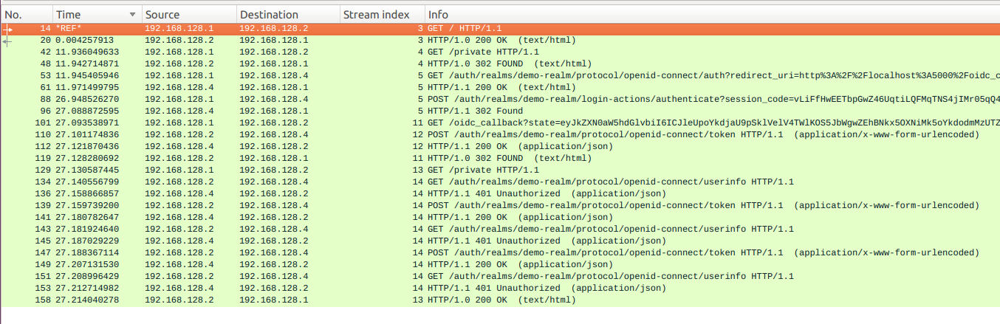

An Example with flask and keycloak, running in Docker

Forked from [houmie/SSO](https://github.com/houmie/sso)

#### Instructions
1. Bring up the Dockers

```
docker-compose build
docker-compose up -d
```
2. Login to keycloak at [http://localhost:8080](http://localhost:8080) with `admin` and `Pa55w0rd`
3. Add a realm called `demo-realm`
3. Import the client from the file `realm-export.json`
4. Add a user
5. Login to demo at [http://localhost:5000](http://localhost:5000)

#### OIDC Primer

See [here](https://developer.okta.com/blog/2017/07/25/oidc-primer-part-1)
#### Packet Capture

Use `docker network ls` and `ip addr show` to locate the correct interface
See [here](https://byteplumbing.net/2018/01/inspecting-docker-container-network-traffic/) for info on packet capture inside docker compose

Key:

```bash
192.168.128.1 : Browser(Host)
192.168.128.2 : web
192.168.128.4 : keycloak
```



